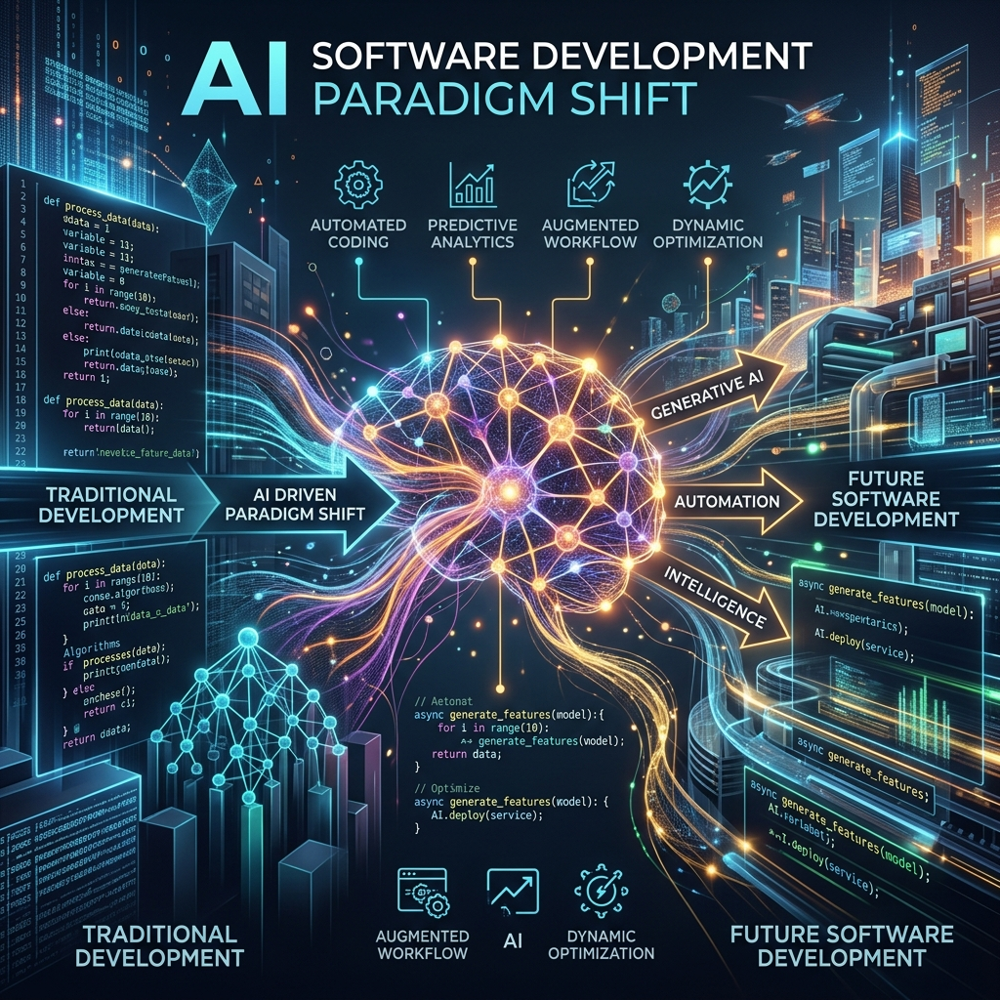
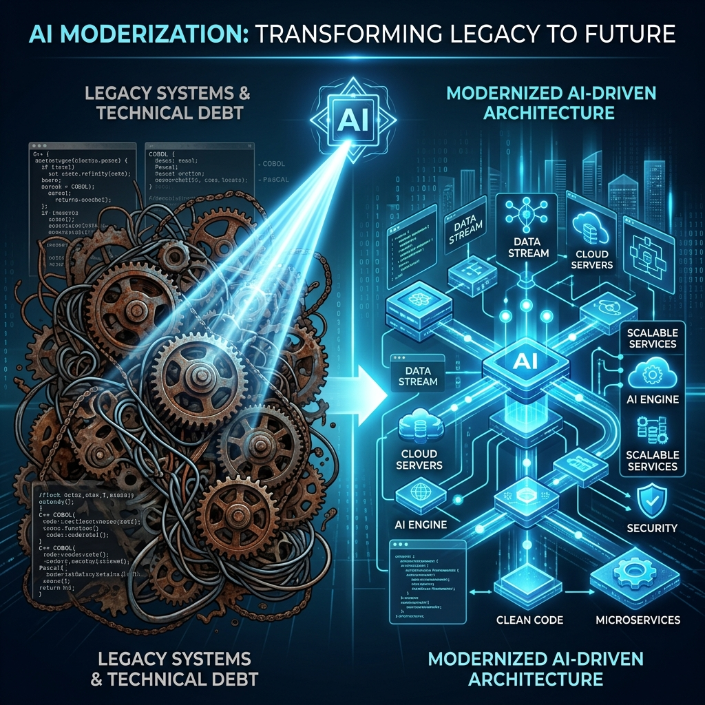

# AI 시대의 개발 패러다임 혁신: 바이브 코딩과 AX
### 부제: 코드 작성에서 에이전틱 엔지니어링으로

---

# 1. 개발 환경의 변화: 바이브 코딩 (Vibe Coding)
<!-- _style: font-size: 0.9em; -->

- **개념**: 사람이 직접 코드를 작성하는 대신 AI에게 지시하여 코드를 생성하는 방식.
- **에이전틱 엔지니어링**: 단순 코드 생성을 넘어 기획, 설계, 개발을 AI 에이전트가 수행.
- **업계 동향**: 리누스 토발즈, 안드레이 카파시 등 주요 인사들도 그 유용성을 인정하고 활용.
- **효과**: 개발 속도와 생산성의 비약적 향상, 코딩에 소모되는 시간 최소화.

---

# 2. 디버깅 패러다임의 전환
<!-- _style: font-size: 0.9em; -->

- **기존 방식**: 에러 발생 시 개발자가 소스 코드를 한 줄씩 분석하고 직접 수정.
- **바이브 코딩 방식**: 
  - 코드를 직접 수정하지 않음.
  - 문제의 원인이 되는 **요구 조건(스펙)**이나 **테스트 케이스**를 수정.
  - 수정된 조건을 바탕으로 AI가 코드를 처음부터 다시 작성.
- **궁극적 목표**: 사람은 더 이상 코드를 직접 들여다보지 않는 수준으로 진화.

---

# 3. 토큰 이코노미: 투자가 곧 생산성
<!-- _style: font-size: 0.9em; -->

- **토큰의 의미**: AI를 사용하기 위해 지불하는 비용 = 개발자의 생산성을 높이는 핵심 연료.
- **비용 절감의 오류**: 토큰 비용을 아끼는 것은 비행기의 기름값을 아끼느라 비행기를 땅에 묶어두는 것과 같음.
- **경쟁력의 핵심**:
  - 토큰을 많이 쓸수록 회사에 더 큰 부가가치 창출 (우수 개발자일수록 토큰 사용량이 많음).
  - 토큰을 적극적으로 투자하여 1인당 생산성을 극대화하는 기업만이 생존.

---

# 4. 레거시 시스템의 AI 전환 (바코 리라이트)
<!-- _style: font-size: 0.9em; -->

- **바코 리라이트 (Baco Rewrite)**: 기존의 복잡한 레거시 코드를 AI를 활용해 전면 재작성하는 작업.
- **필요성**: 사람이 작성한 코드는 히스토리가 복잡하여 분석과 유지보수가 어려움.
- **해결책**:
  1. AI에게 기존 코드를 학습시켜 완벽히 이해시킴.
  2. AI가 가장 잘 다루는 언어나 최신 구조로 시스템 전체를 새로 작성.
- **기대 효과**: 향후 시스템 유지보수와 기능 추가를 사람 개입 없이 AI가 전담 가능.

---

# 5. 개발자의 새로운 역할: AI 에이전트 관리자
<!-- _style: font-size: 0.9em; -->

- **역할의 변화**: 직접 코딩하는 실무자 ➡️ 여러 AI 에이전트를 조율하는 '감독(매니저)'.
- **핵심 역량**: 특정 언어의 문법 지식보다 **AI에게 명확한 요구사항(프롬프트)과 테스트 케이스를 설계하는 능력**.
- **효율성 극대화**:
  - 소수 인원으로 iOS, Android, Web, Backend 등 풀스택 하이브리드 개발 수행.
  - 여러 AI 에이전트에게 동시에 작업을 지시하며 병렬 멀티태스킹 최적화.

---

# 결론
> **"개발 환경은 인간이 직접 코딩하는 시대에서, AI를 효율적으로 부려 생산성을 극대화하는 시대로 완전히 넘어갔습니다. 바이브 코딩으로의 전환은 이제 선택이 아닌 생존의 문제입니다."**
