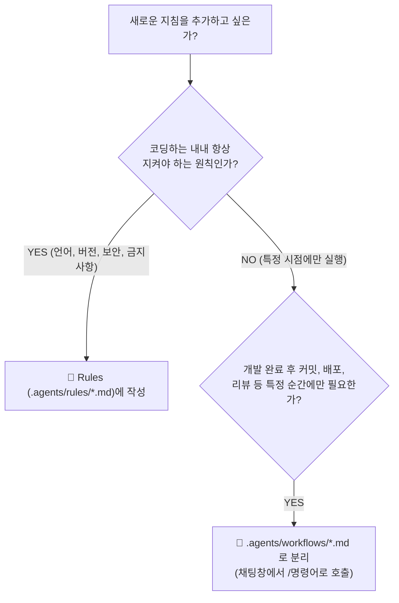

# ⚙️ AI 에이전트 규칙(Rules) & 워크플로우(Workflows) 핵심 가이드

> **"AI 에이전트를 잘 다루는 핵심은 '항상 지켜야 할 상시 규칙(Rules)'과 '필요할 때 호출하는 절차적 작업(Workflows)'을 명확히 분리하는 데 있습니다."**

---

## ⚡ 한눈에 비교: Rules vs Workflows

| 비교 항목 | 📜 규칙 (Rules / `rules/`) | 🚀 워크플로우 (Workflows / `/command`) |
| :--- | :--- | :--- |
| **개념** | 에이전트가 코딩하는 내내 항상 준수해야 할 **상시 제약 조건** | 특정 작업 시점에 사용자가 호출하는 **온디맨드 절차 매뉴얼** |
| **적용 시점** | 매 대화 턴마다 컨텍스트에 **자동 상시 포함** | 채팅창에서 슬래시 커맨드(예: `/commit`) 입력 시에만 로드 |
| **토큰 소비** | 대화가 길어져도 계속 컨텍스트를 차지함 (**비용 발생**) | 호출할 때만 1회성으로 로드되어 **토큰 낭비 제로** |
| **파일 위치** | `.agents/rules/*.md` (워크스페이스) 또는 `~/.gemini/config/rules/` (전역) | `.agents/workflows/<command-name>.md` |
| **대표 사용처** | 기술 스택/버전 고정, 금지 라이브러리, 보안 수칙, TDD 원칙 | **깃 커밋 메시지 생성(`/commit`)**, 배포, 코드 리뷰, 릴리즈 노트 |

---

## 📜 Section 1. 규칙 (Rules) 설정 가이드

규칙은 에이전트에게 **"우리 프로젝트의 법과 원칙"**을 정해주는 것입니다.

### 1. 버전 및 기술 스택 명시하기
- **이유**: AI는 과거 레거시 방식부터 최신 문법까지 모두 알고 있어, 버전이 불명확하면 시대가 뒤섞인 코드를 작성합니다.
- **작성 팁**: 구체적인 패키지 매니저와 버전 번호를 못 박아 둡니다.
  - *"파이썬 패키지 및 가상환경 관리는 uv를 쓰고 3.12 버전을 기본으로 사용할 것."*
  - *"iOS 코드를 작성할 때는 Storyboard 대신 SwiftUI를 사용할 것."*

### 2. 하지 말아야 할 것(금지 규칙) 명시하기
- **이유**: AI는 기본적으로 과도한 의욕을 발휘해 불필요한 서드파티 라이브러리를 설치하거나 오래된 우회 방식을 쓸 수 있습니다.
- **작성 팁**: 하지 말아야 할 행동을 단호하게 명시합니다.
  - *"플러터에서 `dynamic` 타입을 절대 사용하지 말 것."*
  - *"API Key나 비밀번호를 코드에 직접 적지 말고, 반드시 `.env` 환경 변수를 참조할 것."*

### 3. 테스트 코드 및 개발 프로세스 규칙
- **이유**: 테스트 작성을 강제하면 에이전트가 놓쳤던 엣지 케이스를 스스로 발견하고 해결합니다.
  - *"백엔드 기능 구현 계획(Plan)을 세울 때는 반드시 TDD 절차(테스트 선작성 ➡️ 기능 구현 ➡️ 리팩터링)로 단계를 나눌 것."*

> [!TIP]
> ### 💡 규칙 작성 시 주의사항
> AI가 이미 잘 알고 있는 일반 상식(예: *"변수명을 의미 있게 지어라"*, *"try-catch로 예외 처리하라"*)은 적지 마세요. **"우리 프로젝트만의 고유한 제약 조건"**만 간결하게 작성할 때 준수율이 가장 높습니다.

### 📋 Rules 실전 예시: 규칙 파일 템플릿 (`.agents/rules/coding_standards.md`)

```markdown
# 프로젝트 규칙 (coding_standards.md)

## 1. 언어 및 커뮤니케이션
- 모든 답변, 코드 주석, 커밋 관련 설명은 반드시 **한국어**로 작성할 것.

## 2. 개발 환경 및 기술 스택
- **Python**: 가상환경 및 패키지 관리는 **uv**를 사용하며, 기본 버전은 **Python 3.12**로 고정함.
- **Frontend**: 스타일링은 TailwindCSS 대신 순수 CSS(Vanilla CSS) 및 CSS 변수를 활용할 것.

## 3. 금지 규칙 (Never Do)
- API Key, DB 접속 비밀번호 등 민감 정보를 코드에 하드코딩하지 말 것.
- `.env` 파일 및 민감한 설정 파일을 읽거나 채팅 답변에 출력하지 말 것.
- 사전에 협의되지 않은 외부 라이브러리를 임의로 `install`하지 말 것.

## 4. 품질 및 테스트 원칙
- 새로운 비즈니스 로직 작성 시 반드시 단위 테스트(Unit Test)를 함께 작성할 것.
```

---

## 🚀 Section 2. 워크플로우 (Workflows) 설정 가이드

워크플로우는 에이전트에게 **"명령을 내렸을 때 수행할 정형화된 작업 매뉴얼"**을 만들어 주는 것입니다.

### 1. 왜 특정 작업은 규칙이 아니라 워크플로우로 만들어야 할까?
- **커밋 메시지 생성, 배포, 릴리즈 노트 작성** 같은 작업은 코딩하는 내내 필요한 게 아닙니다.
- 이런 절차까지 Rules(상시 규칙)에 넣어두면, **매 대화마다 불필요한 토큰이 낭비되고 에이전트의 집중도가 떨어집니다.**
- 워크플로우 파일로 만들어 두면, 채팅창에 **`/커맨드명`**을 입력했을 때만 정확히 호출되어 토큰을 획기적으로 아낄 수 있습니다.

### 2. 워크플로우 작성 요령
1. **위치**: 프로젝트 루트의 `.agents/workflows/<파일명>.md` (예: `commit.md`)
2. **YAML Frontmatter**: 파일 상단에 `description:`을 적어주면 에이전트가 언제 써야 할지 이해합니다.
3. **명확한 단계(Process)**: 1단계 Context 파악 ➡️ 2단계 컨벤션 적용 ➡️ 3단계 출력 형식 순으로 작성합니다.

### 📋 Workflow 실전 예시: 커밋 메시지 생성 (`.agents/workflows/commit.md`)

```markdown
---
description: 사용자와의 대화 내역을 분석하여 커밋 컨벤션에 맞게 커밋 메시지를 생성합니다.
---

# 커밋 메시지 생성 워크플로우

## 1. 커밋 컨벤션 기준
- `feat:` 새로운 기능 추가
- `fix:` 버그 수정
- `docs:` 문서 수정
- `refactor:` 코드 리팩터링 (기능 변경 없음)
- `test:` 테스트 코드 추가 및 수정
- `chore:` 빌드, 패키지 매니저, 환경 설정 변경

## 2. 작동 프로세스
1. **작업 분석**: 현재 대화 세션에서 실제로 수정·추가된 파일 및 작업 내용을 파악합니다.
2. **컨벤션 적용**: 위의 기준에 따라 가장 적합한 타입을 선택하고 명확한 한국어로 요약합니다.
3. **결과 출력**: 사용자가 즉시 복사해서 쓸 수 있도록 반드시 **마크다운 코드 블록** 안에 담아서 출력합니다.

## 3. 출력 예시
```bash
feat: 회원가입 이메일 중복 확인 기능 추가

- 이메일 중복 체크 API 엔드포인트 연동
- 중복 시 경고 문구 실시간 표시 로직 구현
```

---

## 💡 최종 요약: 언제 무엇을 쓸까?




