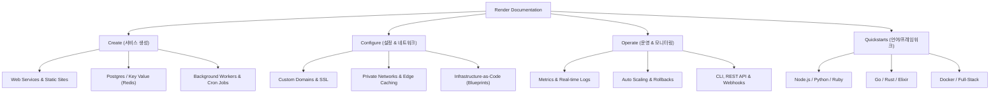

# Render Documentation (`https://render.com/docs`) 분석 및 설명 가이드

브라우저 서브에이전트를 활용해 **Render 공식 문서(`https://render.com/docs`)** 전체를 탐색하고 주요 서비스 구성, 배포 방식, 인프라 관리 기능 및 제약 사항을 정리한 문서입니다.

---

## 1. Render(렌더)란 무엇인가?

**Render**는 Heroku의 최신 대안으로 크게 주목받고 있는 현대적인 **클라우드 PaaS (Platform as a Service)** 플랫폼입니다.  
개발자가 복잡한 서버 구축 및 인프라(AWS/GCP 등) 설정 없이, 코드 저장소(GitHub/GitLab) 연결만으로 서비스, 데이터베이스, 정적 웹사이트, 백그라운드 작업 등을 손쉽게 배포하고 자동 스케일링할 수 있도록 돕습니다.

---

## 2. Render 문서(`render.com/docs`)의 주요 카테고리 구성

Render 공식 문서는 크게 4가지 핵심 영역으로 분류되어 있습니다.

---

### ① Create (서비스 및 데이터베이스 생성)
*   **Web Services**: Node.js, Python, Go, Rust, Ruby, Elixir, Docker 등 웹 애플리케이션 및 API 백엔드 배포
*   **Static Sites**: React, Vue, Next.js, Astro 등 정적 사이트를 글로벌 CDN에 무료로 배포
*   **Render Postgres**: 완전 관리형(Fully Managed) PostgreSQL 데이터베이스 제공
*   **Render Key Value**: Redis® 호환 인메모리 키-값 데이터 저장소
*   **Background Workers**: 비동기 대기열 작업 및 백그라운드 처리 전용 인스턴스 (예: Celery, Sidekiq)
*   **Cron Jobs**: 반복 정기 스케줄링 작업
*   **Workflows (BETA)**: 분산 컴퓨팅 환경에서의 다단계 장기 실행 워크플로우 체인

---

### ② Configure (네트워크, 인프라 및 설정)
*   **Service Settings**: 사용자 지정 도메인 설정, 자동 관리형 SSL/TLS 증명서, 환경 변수(Environment Variables) 및 모노레포(Monorepo) 구성
*   **Networking**: 서비스 간 안전한 통신을 위한 사설 네트워크(Private Network), 리전 선택, 아웃바운드 고정 IP, 에지 캐싱(Edge Caching)
*   **Infrastructure-as-Code (Blueprints)**: `render.yaml` 단일 설정 파일로 전체 멀티 서비스 인프라를 코드화하여 자동 프로비저닝 (Terraform Provider 지원)
*   **Preview Environments**: Git Pull Request 생성을 감지하여 임시 테스트 인프라 환경 자동 생성

---

### ③ Operate (운영, 스케일링 및 모니터링)
*   **Service Actions**: 트래픽 증가에 따른 **자동 스케일링(Auto Scaling)**, 원클릭 배포 롤백(Rollbacks), 유지보수 모드, 일회성 작업(One-off Jobs) 실행
*   **Monitoring**: 실시간 CPU/Memory metrics 모니터링, 실시간 로그(Logs) 스트리밍, 헬스 체크(Health Checks), 알림 연동
*   **Integrations**: Render CLI, REST API, Webhooks, Coding Agents(AI 호환 연동)

---

### ④ Quickstarts (언어 및 프레임워크 퀵스타트)
공식 문서에서는 거의 모든 주요 언어와 프레임워크에 대한 템플릿과 가이드를 제공합니다.

| 언어 / 기술 스택 | 지원되는 프레임워크 & 라이브러리 |
| :--- | :--- |
| **Node.js / JS** | Express, Next.js, SvelteKit, Remix, NuxtJS, NestJS, Strapi |
| **Python** | Django, Flask, FastAPI, Celery |
| **Static Sites** | Astro, Vite, Create React App, Jekyll, Hugo |
| **Ruby / Go / Rust** | Rails, Sinatra, Gin, Beego, Rocket, Actix |
| **Elixir** | Phoenix, Phoenix Cluster |
| **Docker** | 컨테이너 이미지 직접 배포 (WordPress, Ghost, Metabase, n8n 등) |

---

## 3. 배포 워크플로우 (How Deploys Work)

Render에서의 기본 배포 프로세스는 매우 간결합니다:

1. **Git 저장소 연결**: GitHub 또는 GitLab 계정을 연결하여 배포할 레포지토리 선택
2. **빌드 설정 (Build & Start Command)**:
   * Native Runtime (예: Node.js) 사용 시 `Build Command` (예: `npm install && npm run build`)와 `Start Command` (예: `npm start`) 입력
   * Dockerfile 사용 시 레포지토리 내 `Dockerfile` 경로 지정
3. **자동 배포 (Continuous Deployment)**:
   * `git push` 시 Render가 이벤트를 감지하여 자동으로 빌드 및 무중단 배포(Zero-downtime deploy) 수행

---

## 4. 무료 플랜(Free Tier) 가이드 및 주요 제약 사항

> [!IMPORTANT]
> Render의 Free 플랜은 개인 프로젝트나 프로토타입에 유용하지만 다음과 같은 명확한 규칙과 제약이 있습니다.

1. **Free Instance Hours**: 월 750시간의 무료 컴퓨트 인스턴스 타임이 제공됩니다.
2. **자동 휴면 (Spin-down on idle)**: Free Web Service는 **15분간 트래픽이 없으면 자동 휴면 모드**로 진입하며, 새로운 요청이 오면 재활성화까지 **최대 50초 지연(Cold Start)**이 발생할 수 있습니다.
3. **Free Postgres (30일 제한)**: Free Postgres 데이터베이스는 **생성 후 30일간 지속**되며, 만료 후 14일 유예기간 내에 유료 플랜으로 업그레이드하지 않으면 데이터가 영구 삭제됩니다.
4. **Free Key Value (Redis)**: 인메모리 전용으로 동작하여 서버 재시작 시 데이터가 유지되지 않습니다 (디스크 비지속성).

---

## 5. 결론 및 총평

`https://render.com/docs`는 초보 개발자부터 엔터프라이즈 팀까지 손쉽게 클라우드 인프라를 운영할 수 있도록 뛰어난 가이드와 프레임워크 퀵스타트를 제공합니다. 

*   **단순 웹사이트/API**: Quickstarts 참고 후 Git 연결로 5분 내 배포 가능
*   **복잡한 멀티 서비스 인프라**: `render.yaml` (Blueprints)을 활용하여 코드 기반 인프라(IaC) 관리 가능

비디오 탐색 기록:

