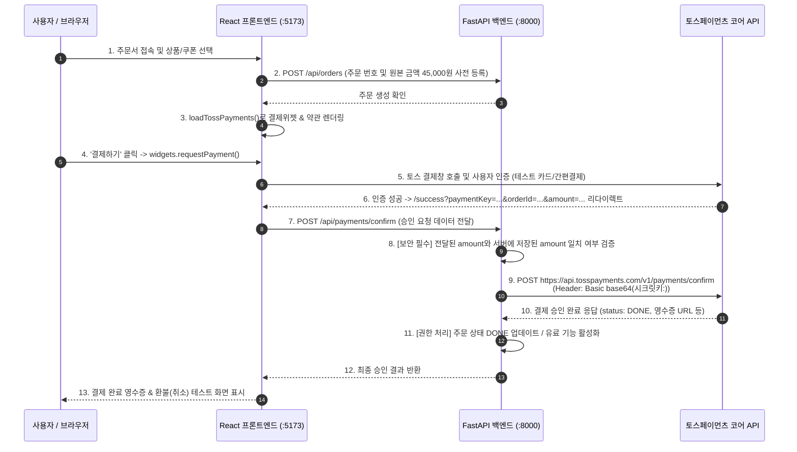
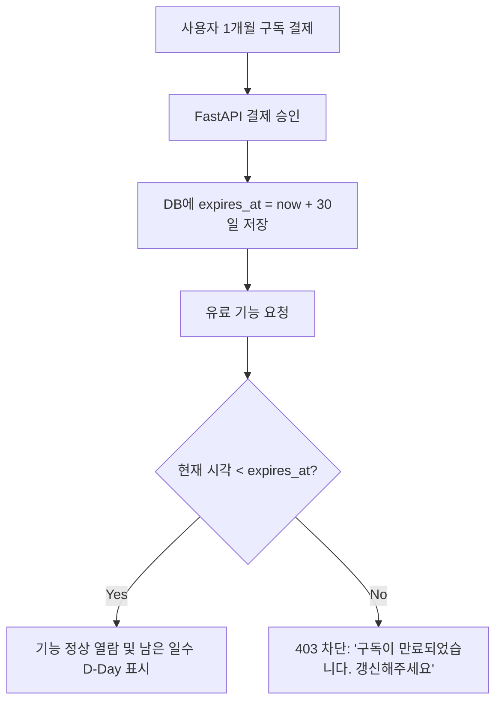

# 토스페이먼츠 V2 테스트 결제 및 구독 연동 실습 가이드

React(Vite)와 Python(FastAPI)을 기반으로 구현한 **토스페이먼츠 최신 V2 표준 SDK(주문서형 결제)** 연동, 결제 승인/취소, 그리고 앱 서비스 유료 기능 해금 및 1개월 구독 모델 구현에 대한 종합 가이드 문서입니다.

---

## 📌 목차
1. [시스템 아키텍처 및 결제 흐름](#1-시스템-아키텍처-및-결제-흐름)
2. [API 키 체계 및 핵심 보안 원칙](#2-api-키-체계-및-핵심-보안-원칙)
3. [프로젝트 구조](#3-프로젝트-구조)
4. [프론트엔드 구현 (React + Vite)](#4-프론트엔드-구현-react--vite)
5. [백엔드 구현 (Python FastAPI)](#5-백엔드-구현-python-fastapi)
6. [실전 응용: 유료 기능 해금 & 1개월 구독 모델 구현법](#6-실전-응용-유료-기능-해금--1개월-구독-모델-구현법)
7. [로컬 실행 및 테스트 방법](#7-로컬-실행-및-테스트-방법)

---

## 1. 시스템 아키텍처 및 결제 흐름

토스페이먼츠는 **서버 신뢰 모델(Server-Authoritative Model)**을 따릅니다. 클라이언트는 결제 인증만 수행하며, **실제 결제 완료(승인) 및 권한 부여는 반드시 백엔드 서버에서 처리**해야 합니다.



---

## 2. API 키 체계 및 핵심 보안 원칙

### 1) 클라이언트 키 vs 시크릿 키
* **Client Key (`test_gck_*`)**: 브라우저(프론트엔드)에서 SDK 초기화에 사용. 외부에 노출되어도 무방함.
* **Secret Key (`test_sk_*`)**: 결제 승인, 조회, 취소(환불)를 호출할 때 사용. **절대로 브라우저나 GitHub에 노출되어서는 안 되며 백엔드 서버 환경변수로만 관리**.

### 2) 공식 공용 테스트 키 (Docs Key)
토스페이먼츠는 회원가입 없이도 즉시 연동 테스트가 가능하도록 공용 샌드박스 키를 제공합니다:
* `VITE_TOSS_CLIENT_KEY=test_gck_docs_Ovk5rk1EwkEbP0W43n07xlzm`
* `TOSS_SECRET_KEY=test_gsk_docs_OaPz8L5KdmQXkzRz3y47BMw6`

> [!NOTE]
> **내 전용 테스트 키와의 차이점**:
> 공용 키로도 결제/승인/취소 등 모든 API가 동작하지만, [토스 개발자센터 대시보드](https://developers.tosspayments.com)에서 실시간 결제 내역 확인, 가상계좌 웹훅 등록, 결제창 UI 커스텀을 하려면 이메일 회원가입(무료, 사업자등록 불필요) 후 내 전용 키를 발급받아 교체하면 됩니다.

### 3) Basic Auth 인증 규격 (가장 흔한 실수 주의)
토스페이먼츠 API를 호출할 때는 **시크릿 키 뒤에 콜론(`:`)을 붙인 뒤 base64로 인코딩**해야 합니다:
```python
# Python
import base64
encoded_key = base64.b64encode(f"{TOSS_SECRET_KEY}:".encode("utf-8")).decode("utf-8")
headers = {"Authorization": f"Basic {encoded_key}"}
```

### 4) 금액 위변조 검증 (Mandatory Amount Verification)
사용자가 브라우저 콘솔에서 `amount`를 100원으로 변조하여 결제 인증을 받을 수 있으므로, 백엔드에서 토스 승인 API를 호출하기 전에 **서버에 저장된 원래 주문 금액과 일치하는지 반드시 대조**해야 합니다.

---

## 3. 프로젝트 구조

```text
ch14/toss/
├── README.md                      # 본 가이드 문서
├── backend/                       # Python FastAPI 백엔드 서버
│   ├── main.py                    # 결제 승인, 취소, 위변조 검증, CORS
│   ├── requirements.txt           # fastapi, uvicorn, httpx, pydantic, python-dotenv
│   └── .env                       # TOSS_SECRET_KEY, PORT
│
└── frontend/                      # React (Vite) 클라이언트
    ├── src/
    │   ├── App.jsx                # 라우터 설정 (/, /success, /fail)
    │   ├── main.jsx               # React 마운트 진입점
    │   ├── index.css              # 모던 토스 스타일 UI 디자인
    │   └── pages/
    │       ├── CheckoutPage.jsx   # 토스 V2 결제위젯 마운트 & 결제 요청
    │       ├── SuccessPage.jsx    # FastAPI 승인 요청 & 영수증/환불 UI
    │       └── FailPage.jsx       # 결제 실패 처리 UI
    ├── package.json               # @tosspayments/tosspayments-sdk, react-router-dom
    ├── vite.config.js             # 백엔드 API 프록시 설정
    └── .env                       # VITE_TOSS_CLIENT_KEY
```

---

## 4. 프론트엔드 구현 (React + Vite)

### 1) SDK 설치 및 초기화
```bash
npm install @tosspayments/tosspayments-sdk react-router-dom lucide-react
```

### 2) 결제 위젯 렌더링 및 동적 금액 변경 (`CheckoutPage.jsx`)
```jsx
import { useEffect, useRef, useState } from 'react'
import { loadTossPayments } from '@tosspayments/tosspayments-sdk'

const CLIENT_KEY = import.meta.env.VITE_TOSS_CLIENT_KEY

export default function CheckoutPage() {
  const [widgets, setWidgets] = useState(null)
  const isInitialized = useRef(false)

  useEffect(() => {
    if (isInitialized.current) return
    isInitialized.current = true

    async function init() {
      // 1. SDK 로드
      const tossPayments = await loadTossPayments(CLIENT_KEY)
      const tossWidgets = tossPayments.widgets({ customerKey: 'USER_UNIQUE_KEY' })

      // 2. 금액 설정 및 UI 마운트
      await tossWidgets.setAmount({ currency: 'KRW', value: 50000 })
      await tossWidgets.renderPaymentMethods({ selector: '#payment-method', variantKey: 'DEFAULT' })
      await tossWidgets.renderAgreement({ selector: '#agreement', variantKey: 'AGREEMENT' })

      setWidgets(tossWidgets)
    }
    init()
  }, [])

  // 할인 쿠폰 선택 시 실시간 결제 금액 동기화
  const handleCouponChange = async (discountAmount) => {
    if (widgets) {
      await widgets.setAmount({ currency: 'KRW', value: 50000 - discountAmount })
    }
  }

  // 결제창 호출
  const handlePayment = async () => {
    await widgets.requestPayment({
      orderId: `ORDER_${Date.now()}`,
      orderName: '프리미엄 서비스 이용권',
      successUrl: `${window.location.origin}/success`,
      failUrl: `${window.location.origin}/fail`,
    })
  }

  return (
    <div>
      <div id="payment-method"></div>
      <div id="agreement"></div>
      <button onClick={handlePayment}>결제하기</button>
    </div>
  )
}
```

---

## 5. 백엔드 구현 (Python FastAPI)

### 1) 결제 승인 API (`POST /api/payments/confirm`)
```python
@app.post("/api/payments/confirm")
async def confirm_payment(request: ConfirmPaymentRequest):
    # 1. 서버 측 금액 위변조 검증
    saved_order = orders_db.get(request.orderId)
    if saved_order and saved_order["amount"] != request.amount:
        raise HTTPException(status_code=400, detail="결제 금액 위변조 감지")

    # 2. 토스 코어 승인 API 호출
    headers = {
        "Authorization": get_toss_auth_header(), # Basic base64(시크릿키:)
        "Content-Type": "application/json"
    }
    payload = {
        "paymentKey": request.paymentKey,
        "orderId": request.orderId,
        "amount": request.amount
    }

    async with httpx.AsyncClient() as client:
        response = await client.post(
            "https://api.tosspayments.com/v1/payments/confirm",
            headers=headers,
            json=payload
        )
        if response.status_code != 200:
            raise HTTPException(status_code=response.status_code, detail=response.json())
            
        return {"success": True, "data": response.json()}
```

### 2) 결제 취소(환불) API (`POST /api/payments/{paymentKey}/cancel`)
```python
@app.post("/api/payments/{payment_key}/cancel")
async def cancel_payment(payment_key: str, request: CancelPaymentRequest):
    headers = {
        "Authorization": get_toss_auth_header(),
        "Content-Type": "application/json"
    }
    async with httpx.AsyncClient() as client:
        response = await client.post(
            f"https://api.tosspayments.com/v1/payments/{payment_key}/cancel",
            headers=headers,
            json={"cancelReason": request.cancelReason}
        )
        return {"success": True, "data": response.json()}
```

---

## 6. 실전 응용: 유료 기능 해금 & 1개월 구독 모델 구현법

쇼핑몰 형태가 아닌 **일반 웹/앱 서비스에서 결제 완료 시 특정 페이지/기능을 열람하게 하거나 1개월간 이용하게 하는 패턴**입니다.

### 패턴 A: 유료 기능 잠금 해제 (Paywall / 단건 열람권)
* **원리**: 결제 승인 API(`status: DONE`) 성공 시, DB의 사용자 레코드에 `has_access = True` 또는 `is_premium = True`를 부여합니다.
* **프론트엔드 라우트 보호 (Route Guard)**:
  ```jsx
  function PremiumReportPage({ user }) {
    if (!user.isPremium) {
      return <PaywallCard onBuy={() => navigate('/checkout')} />
    }
    return <SecretReportContent />
  }
  ```

---

### 패턴 B: 1개월 기간제 구독 모델 (가장 추천)
사용자가 결제할 때마다 **30일간 이용 권한**을 부여하고, 만료일이 지나면 자동으로 서비스를 차단하는 방식입니다.



```python
from datetime import datetime, timedelta

@app.post("/api/payments/confirm-subscription")
async def confirm_subscription(request: ConfirmPaymentRequest):
    # 토스 결제 승인 후
    now = datetime.now()
    expires_at = now + timedelta(days=30) # 1개월 만료일 계산
    
    users_db[user_id]["subscription"] = {
        "is_active": True,
        "plan": "PRO_MONTHLY",
        "expires_at": expires_at.isoformat()
    }
    return {"success": True, "expires_at": expires_at}

# 유료 API 호출 시 검증 미들웨어/의존성
def verify_subscription(user_id: str):
    sub = users_db[user_id].get("subscription")
    if not sub or datetime.now() > datetime.fromisoformat(sub["expires_at"]):
        raise HTTPException(status_code=403, detail="구독이 만료되었습니다.")
```

---

### 패턴 C: 매달 자동 갱신되는 정기결제 (Auto-Billing)
매달 사용자의 개입 없이 카드로 자동 결제되게 하는 방식입니다.
1. **빌링키 발급**: 프론트엔드에서 `tossPayments.payment().requestBillingAuth()`를 호출해 카드 정보를 등록하고 `billingKey`를 발급받습니다.
2. **1회차 결제**: 백엔드에서 `POST /v1/billing/{billingKey}`를 호출하여 즉시 첫 달 요금을 청구합니다.
3. **정기 스케줄러**: 백엔드 스케줄러(예: `APScheduler` or Cron)가 매월 결제일마다 자동으로 `POST /v1/billing/{billingKey}`를 호출하여 다음 달 요금을 결제하고 만료일을 30일씩 연장합니다.

---

## 7. 로컬 실행 및 테스트 방법

### 1) 백엔드 서버 실행
```bash
cd backend
pip install -r requirements.txt
python -m uvicorn main:app --host 127.0.0.1 --port 8000 --reload
```
* Swagger API 문서: `http://localhost:8000/docs`

### 2) 프론트엔드 서버 실행
```bash
cd frontend
npm install
npm run dev
```
* 프론트엔드 주문서: `http://localhost:5173/`

### 3) 테스트 시나리오
1. `http://localhost:5173/` 접속
2. 할인 쿠폰 선택 (실시간 금액 동기화 확인)
3. '결제하기' 버튼 클릭 → 토스 테스트 결제창 팝업 확인
4. 테스트 카드 또는 계좌이체로 결제 완료
5. `/success` 페이지에서 백엔드 승인 응답 및 토스 공식 영수증 링크 확인
6. '결제 취소(환불) 테스트' 버튼을 눌러 결제 취소 API 정상 동작 확인
