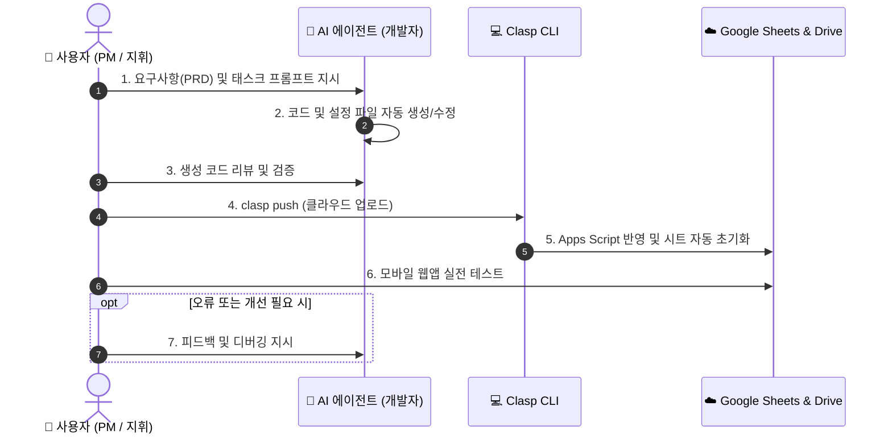

# 📱 [바이브 코딩 구현 계획서] AI 에이전트와 함께 만드는 '스마트 영수증 가계부'

> **문서 버전**: v2.0 (바이브 코딩 에이전트 협업 전용)  
> **기반 문서**: [gas_vibe_practice_guide.md](./gas_vibe_practice_guide.md)  
> **개발 방식**: **Vibe Coding** (사용자는 요구사항 지시와 검증에 집중, 코드는 AI 에이전트가 전담 생성)  
> **기술 스택**: Google Apps Script (GAS V8), Google Sheets, Google Drive API, Clasp CLI, HTML5 SPA

---

## 🎯 1. 바이브 코딩 개발 원칙 및 협업 모델

본 프로젝트는 수백 줄의 코드를 직접 타이핑하거나 복사하지 않고, **사용자가 AI 에이전트에게 명확한 역할과 요구사항을 지시하여 결과물을 만들어내는 방식**으로 진행됩니다.



---

## 🗺️ 2. 단계별 에이전트 협업 태스크 로드맵

```text
[TASK 1] 클라우드 리소스 준비 & 로컬 프로젝트 환경 설정 (15분)
   │     └─ 구글 시트/폴더 준비 + AI에게 설정 파일(.clasp.json, package.json) 작성 지시
   ▼
[TASK 2] 가계부 백엔드 로직 구축 지휘 (`Code.js`) (20분)
   │     └─ AI에게 시트 초기화, 드라이브 영수증 저장, 지출 CRUD API 생성 지시
   ▼
[TASK 3] 모바일 웹 프론트엔드 UI 구축 지휘 (`Index.html`) (25분)
   │     └─ AI에게 핀테크 카드 UI, 모바일 카메라 연동, Base64 비동기 전송 지시
   ▼
[TASK 4] 원클릭 클라우드 푸시 & 스프레드시트 자동 초기화 (15분)
   │     └─ clasp push → Apps Script setupSheets() 실행으로 3개 시트 자동 구성
   ▼
[TASK 5] 웹 앱(Web App) 배포 & 환경 변수 바인딩 (15분)
   │     └─ Web App 배포 URL 발급 및 시트 '설정' 탭에 드라이브/웹앱 주소 매핑
   ▼
[TASK 6] 실전 E2E 영수증 등록 검증 & AI 피드백 디버깅 (15분)
   │     └─ 모바일 촬영 테스트 → 시트/드라이브 동기화 확인 → AI와 예외 처리 보완
   ▼
[TASK 7] AI 협업 커스텀 확장 퀘스트 (20분)
         └─ 월 예산 초과 경고 알림 / 주간 지출 리포트 자동 메일링
```

---

## 🛠️ 3. 태스크별 상세 실행 가이드

---

### 📍 TASK 1. 클라우드 리소스 준비 & 로컬 프로젝트 환경 설정

#### 1. 사람이 수행할 사전 작업 (인프라 생성)
1. **Google Apps Script API 켜기**: [사용자 설정 페이지](https://script.google.com/home/usersettings)에서 API를 **`사용함 (ON)`**으로 전환합니다.
2. **구글 스프레드시트 생성**: 구글 드라이브에서 `나만의_스마트_가계부` 시트를 생성하고 **스프레드시트 ID**를 복사합니다.
3. **구글 드라이브 영수증 폴더 생성**: `가계부_영수증_보관함` 폴더를 만들고 **폴더 전체 URL**을 복사합니다.
4. **로컬 폴더 생성 및 로그인**:
   ```bash
   mkdir smart-ledger && cd smart-ledger
   clasp login
   ```

#### 2. AI 에이전트 지시 프롬프트
AI 에이전트에게 아래 프롬프트를 전달하여 프로젝트 설정 파일을 구성하게 합니다.

> 📋 **[Prompt 1: 프로젝트 설정 파일 구성]**
> ```text
> Node.js 및 Clasp 기반 Google Apps Script 프로젝트를 초기화하려고 해.
> 다음 3개 설정 파일을 작성해줘:
> 1. package.json: clasp push, pull, open 스크립트와 @google/clasp 개발 의존성 포함
> 2. .clasp.json: parentId에 내 스프레드시트 ID '[내_스프레드시트_ID]'를 연결
> 3. appsscript.json: timeZone은 'Asia/Seoul', V8 런타임, 웹앱 익명(ANYONE) 접근 권한 설정
> ```

#### 3. 에이전트 산출물 체크포인트 (Review)
- [ ] `.clasp.json`에 `parentId`가 내 스프레드시트 ID로 바인딩되었는가?
- [ ] `appsscript.json`에 `"access": "ANYONE"` 설정이 들어가 있는가?

#### 4. 클라우드 연결 실행
```bash
clasp create --type sheets --parentId [내_스프레드시트_ID] --title "스마트영수증가계부_백엔드"
```

---

### 📍 TASK 2. 가계부 백엔드 로직 구축 지휘 (`Code.js`)

#### 1. 태스크 목표
Google Sheets를 데이터베이스로, Google Drive를 영수증 파일 저장소로 활용하는 서버리스 백엔드 API를 구축합니다.

#### 2. AI 에이전트 지시 프롬프트

> 📋 **[Prompt 2: 가계부 백엔드 Code.js 작성]**
> ```text
> 너는 Google Apps Script(GAS) 시니어 엔지니어야.
> 구글 스프레드시트를 DB로, 구글 드라이브를 영수증 스토리지로 사용하는 '스마트 영수증 가계부' 백엔드(Code.js)를 작성해줘.
> 
> [필수 요구 함수 및 비즈니스 로직]
> 1. doGet(e):
>    - Index.html을 렌더링하고 모바일 viewport 메타태그와 XFrameOptionsMode.ALLOWALL 적용.
> 
> 2. setupSheets():
>    - '설정', '지출내역', '카테고리별통계' 3개 시트를 자동 생성.
>    - '설정' 시트: A4="영수증 드라이브 폴더 URL", A5="웹앱 배포 URL", A6="이번 달 예산" 라벨 및 입력 서식 배치.
>    - '지출내역' 시트: 헤더(등록일시, 지출일자, 분류, 사용처, 금액, 결제수단, 메모, 영수증링크) 생성, 파스텔 헤더 배경색, 1행 틀고정.
> 
> 3. getTargetDriveFolder():
>    - '설정' 시트 B4 셀의 URL에서 정규식으로 folderId를 추출하여 DriveApp 폴더 객체 반환 (예외 처리 포함).
> 
> 4. submitExpense(payload):
>    - payload: date, category, title, amount, payMethod, memo, receiptData(Base64)
>    - receiptData가 있으면 Base64를 디코딩하여 드라이브 폴더에 'YYYYMMDD_사용처_금액원.jpg'로 파일 생성 후 파일 URL 획득.
>    - '지출내역' 시트 최하단에 새 행 추가 및 금액 원화 서식(₩#,##0), 영수증 HYPERLINK 링크 수식 적용.
>    - 처리 결과 객체({ success, message, receiptUrl }) 반환.
> 
> 5. getRecentExpenses(limit): 최근 지출 5건을 최신순으로 정렬하여 객체 배열로 반환.
> 6. getMonthlySummary(): 이번 달 지출 총액 및 건수, 카테고리별 합계 객체 반환.
> ```

#### 3. 에이전트 산출물 체크포인트 (Review)
- [ ] `submitExpense`에서 Base64 헤더(`data:image/jpeg;base64,`)를 깔끔하게 분리하여 디코딩하는가?
- [ ] 영수증 파일이 드라이브에 저장될 때 파일명이 식별하기 쉽게 명명되는가?
- [ ] `setupSheets` 실행 시 필요한 3개 시트가 모두 정의되어 있는가?

---

### 📍 TASK 3. 모바일 웹 프론트엔드 UI 구축 지휘 (`Index.html`)

#### 1. 태스크 목표
스마트폰 브라우저에서 편리하게 지출을 입력하고, 카메라로 영수증을 즉시 촬영하여 업로드할 수 있는 단일 페이지 웹 애플리케이션(SPA)을 만듭니다.

#### 2. AI 에이전트 지시 프롬프트

> 📋 **[Prompt 3: 모바일 최적화 Index.html 작성]**
> ```text
> Google Apps Script 웹앱에서 동작하는 '스마트 영수증 가계부' 모바일 최적화 SPA UI(Index.html)를 작성해줘.
> HTML, CSS, Vanilla JS가 모두 하나의 파일에 포함되어야 해.
> 
> [UI/UX 디자인 요구사항]
> 1. 디자인 스타일: 토스/카카오뱅크 스타일의 모던 핀테크 카드 UI (둥근 모서리, 부드러운 박스 섀도우, 모바일 반응형 폭 max 480px).
> 2. 상단 헤더: 푸른색 그라데이션 월간 요약 카드 (이번 달 총 지출 ₩ 금액 표시).
> 3. 지출 등록 폼:
>    - 지출 일자 (기본값 오늘)
>    - 카테고리 칩 선택 버튼 (🍽️ 식비, 🚗 교통, 🛍️ 쇼핑, ☕ 카페/간식, 🎬 문화, 💡 기타)
>    - 지출 금액 (입력 시 실시간 1,000단위 콤마 자동 포맷팅)
>    - 사용처 (상호명) 및 결제 수단 (신용카드, 체크카드, 간편결제, 현금)
>    - 📸 영수증 첨부 박스 (<input type="file" accept="image/*" capture="environment">로 모바일 카메라 직접 연동)
>    - 사진 첨부 시 썸네일 미리보기 및 삭제(✕) 버튼
>    - 메모 입력 (선택)
> 4. 제출 및 통신 인터랙션:
>    - 제출 시 FileReader API로 이미지를 Base64 변환 후 google.script.run.submitExpense() 비동기 호출
>    - 로딩 중 버튼 비활성화 및 "영수증 업로드 중..." 텍스트/스피너 피드백
>    - 성공 시 토스트 메시지 팝업, 폼 리셋, 상단 월간 통계 및 최근 내역 즉시 갱신
> 5. 하단 리스트: 최근 등록된 지출 5건 카드 목록 (영수증 보기 바로가기 링크 포함).
> ```

#### 3. 에이전트 산출물 체크포인트 (Review)
- [ ] 카메라 연동을 위해 `<input>`에 `capture="environment"` 속성이 포함되었는가?
- [ ] 금액 입력 시 콤마(`,`)를 제거한 순수 숫자로 백엔드에 전달되는가?
- [ ] `google.script.run`의 `withSuccessHandler`와 `withFailureHandler`가 모두 구현되었는가?

---

### 📍 TASK 4. 원클릭 클라우드 푸시 & 시트 자동 초기화

#### 1. 사람이 수행할 배포 및 실행 액션
1. **코드 푸시**:
   ```bash
   clasp push
   ```
   *(안내창 발생 시 `y` 입력 → `Pushed 3 files.` 확인)*
2. **Apps Script 콘솔 열기**:
   ```bash
   clasp open
   ```
3. **`setupSheets` 원클릭 실행 & 최초 권한 승인**:
   - 상단 함수 선택창에서 **`setupSheets`** 선택 후 **[▶ 실행]** 클릭
   - **권한 검토** 팝업: `계정 선택` → `고급` → `스마트영수증가계부_백엔드(으)로 이동(안전하지 않음)` → `[허용]`
4. **스프레드시트 확인**:
   - 구글 시트로 이동하여 `설정`, `지출내역`, `카테고리별통계` 시트가 자동 생성되었는지 확인합니다.

---

### 📍 TASK 5. 웹 앱(Web App) 배포 & 환경 변수 바인딩

#### 1. 사람이 수행할 웹 앱 배포 조작
1. Apps Script 에디터 우측 상단 **[배포]** → **[새 배포]** 클릭.
2. 유형 선택(톱니바퀴) → **`웹 앱 (Web App)`** 선택:
   - **설명**: `v1.0 영수증 가계부`
   - **다음 사용자로 실행**: **`나 (Me)`**
   - **액세스 권한을 가진 사용자**: **`모든 사용자 (Anyone)`** *(로그인 없이 편리하게 사용하기 위해 필수)*
3. **[배포]** 클릭 후 발급된 **웹 앱 URL** (`https://script.google.com/macros/s/.../exec`) 복사.

#### 2. 스프레드시트 환경 변수 연결
스프레드시트의 **`설정`** 시트 B열에 주소를 입력합니다:
- **B4 셀**: 구글 드라이브 `가계부_영수증_보관함` 폴더 URL 붙여넣기
- **B5 셀**: 방금 복사한 `웹 앱 배포 URL` 붙여넣기

---

### 📍 TASK 6. 실전 E2E 검증 & AI 피드백 디버깅

#### 1. 실전 테스트 시나리오
1. 웹 앱 URL을 스마트폰 브라우저로 엽니다.
2. 영수증(또는 책상 위 소품)을 카메라로 직접 촬영하고 15,000원 지출을 등록합니다.
3. **3대 인프라 실시간 동기화 검증**:
   - 📱 **웹앱 화면**: 토스트 알림 노출 및 최근 내역에 카드 추가 확인
   - 📊 **구글 시트**: `지출내역` 탭에 새 행과 `📸 영수증 보기` 하이퍼링크가 생겼는지 확인
   - 📂 **구글 드라이브**: 영수증 이미지 파일(`20260828_사용처_15000원.jpg`)이 잘 저장되었는지 확인

#### 2. 오류 발생 시 AI에게 지시할 디버깅 프롬프트 템플릿

> 💬 **[Debug Prompt 예시]**
> ```text
> 지출 등록 버튼을 눌렀는데 구글 시트에는 기록되지만 드라이브 폴더에 사진이 저장되지 않아.
> - 에러 증상: 영수증 열에 링크 대신 '-' 표시됨
> - Code.js의 submitExpense와 getTargetDriveFolder 부분을 점검해서 Base64 파싱 및 폴더 파싱 로직의 예외 처리와 로깅을 보강해줘.
> ```

---

### 📍 TASK 7. AI 협업 커스텀 확장 퀘스트 (도전 과제)

기본 가계부가 완성되었다면, AI 에이전트에게 다음 확장 기능을 지시하여 나만의 고성능 가계부로 업그레이드합니다.

#### 퀘스트 1: 🚨 월 예산 초과 경고 알림 시스템 구축
> 📋 **[확장 프롬프트 1]**
> ```text
> '설정' 시트 B6에 적힌 월 예산(예: 500,000원)을 읽어와서, 지출 등록 후 이번 달 누적 지출이 예산을 초과하면 웹앱 화면에 '⚠️ 이번 달 예산을 초과했습니다! (현재 지출: ₩XXX)' 경고 배너를 띄우는 기능을 추가해줘.
> ```

#### 퀘스트 2: 📧 매주 일요일 지출 리포트 이메일 브리핑 자동화
> 📋 **[확장 프롬프트 2]**
> ```text
> Google Apps Script의 시간 기반 트리거(Time-driven Trigger)를 활용하고 싶어.
> 매주 일요일 저녁 9시에 이번 주 지출 내역 합계와 카테고리별 비중을 예쁜 HTML 표로 정리해서 내 구글 계정 이메일로 자동 발송하는 sendWeeklyReport() 함수를 Code.js에 추가해줘.
> ```

---

## 🚨 자주 발생하는 문제 및 바이브 코딩 해결 팁

| 발생 문제 | 원인 | AI에게 지시할 조치 / 해결 방법 |
| :--- | :--- | :--- |
| `User has not enabled the Apps Script API` | 구글 계정의 Apps Script API가 OFF 상태임 | [설정 페이지](https://script.google.com/home/usersettings)에서 **ON**으로 변경 후 다시 `clasp push` |
| B4 셀 에러 또는 드라이브 파일 미저장 | 설정 시트 URL 정규식 불일치 | AI에게 "다양한 형태의 구글 드라이브 공유 링크(folders/, open?id= 등)를 모두 파싱할 수 있도록 getTargetDriveFolder 정규식을 개선해줘"라고 지시 |
| 코드 수정 후에도 화면이 바뀌지 않음 | 웹앱 새 버전 미배포 | `clasp push` 후 Apps Script 에디터 **[배포 관리]**에서 **새 버전(New Version)**으로 업데이트 배포 |
| 모바일에서 카메라가 바로 켜지지 않음 | 파일 인풋 태그 속성 누락 | AI에게 "`<input type='file'>`에 `capture='environment'`와 `accept='image/*'` 속성을 확실히 넣어줘"라고 지시 |
